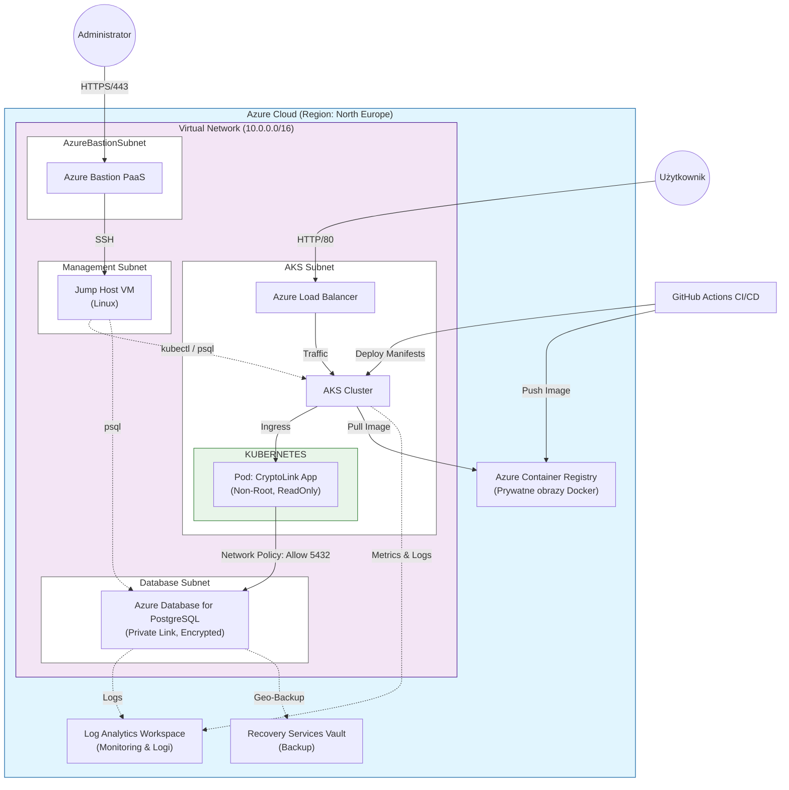

**Temat: Wdrożenie trójwarstwowej bezpiecznej aplikacji
Przedmiot: Bezpieczeństwo Systemów Chmurowych**

## Wykorzystane technologie

W projekcie wykorzystano następujące technologie:
- Azure Kubernetes Service (AKS) do wdrożenia aplikacji jako kontenery,
- Bicep (IaC) do zdefiniowania w kodzie infrastruktury,
- GitHub Actions do automatycznego wdrażania zaktualizowanej wersji aplikacji,
- Azure Database for PostgreSQL do stworzenia bazy danych.

## Wstęp i architektura

Celem projektu było wdrożenie bezpiecznej aplikacji webowej o wysokiej dostępności. Zamiast wdrożenia tradycyjnej maszyny wirtualnej (na przykład w postaci VPS), wykorzystano nowoczesne podejście konteneryzacji z wykorzystaniem Kubernetesa, który zapewnia lepszą izolację procesów, elastyczną skalowalność oraz automatyzację w postaci wykorzystania "Infrastructure as Code"(IaC).

Podstawowymi systemami bezpieczeństwa są:
- Zero Trust Network - wdrożono domyślną blokadę ruchu sieciowego wewnątrz klastra.
- Least Privilege - aplikacja działa z minimalnymi uprawnieniami (zapewnionymi przez RBAC), konto roota nie zostało wykorzystane w żadnym module. Do zrealizowania tego celu utworzono dedykowanego użytkownika (Service Account).
- Defense in Depth - wykorzystano model cebuli celem zapewnienia ochrony na wielu warstwach: NSG-Network Policy-App Security Context.

## Diagram architektury



## Infrastruktura sieciowa oraz zarządzanie dostępem

### Segmentacja sieci z wykorzystaniem VNet

Sieć została podzielona na odseparowane podsieci, co ma na celu odizolowanie warstwy danych od warstwy aplikacyjnej oraz zarządczej.

Konfigurację zrealizowano w następujący sposób:
- aks-subnet - podsieć dla klastra Kubernetes, nie posiada przydzielonych publicznych adresów IP.
- database-subnet - podsieć prywatna dla PostgreSQL, izolująca bazę danych od publicznego dostępu.
- AzureBastionSubnet - podsieć techniczna, ma zapewnić bezpieczny dostęp administracyjny z wykorzystaniem usługi Bastionu.
- management-subnet - podsieć wykorzystywana do zarządzania kontenerami


### Bezpieczeństwo sieciowe z wykorzystaniem Network Security Groups
Ruch sieciowy jest filtrowany za pomocą Network Security Groups (NSG). Wdrożono reguły blokujące bezpośrednio dostęp SSH z sieci internet. 
Filtrowanie działa na zasadzie whitelisty, na której znajduje się ruch HTTP/HTTPS kierowany do Load Balancera.


### Dostęp administracyjny z wykorzystaniem Bastion Host

Ruch sieciowy nie zezwala na bezpośredni dostęp SSH, dlatego by zapewnić łączność serwisową wdrożono usługę Azure Bastion. Pozwala ona na połączenie z infrastrukturą poprzez przeglądarkę, co odbywa się bez konieczności posiadania publicznego adresu IP na maszynach zarządzających.


## Monitoring systemu

Wdrożono centralny system logowania zdarzeń oparty o usługę Azure Log Analytics Workspace. Zbiera on logi aplikacyjne (na przykład z kontenerów) oraz metryki wydajności (wykorzystanie zasobów takich jak CPU oraz RAM). Może zostać wykorzystany do wykrywania anomalii oraz wczesnego wykrywania incydentów bezpieczeństwa.


## Backup oraz szyfrowanie

Konfiguracja odbywała się z myślą o zapewnieniu wysokiej dostępności.

### Backup w innej lokalizacji

Wykorzystano automatyczne backupy zarządzane przez Azure z retencją trzydziestu dni oraz włączoną replikacją geograficzną, co ma na celu zapewnienie odtwarzalności danych nawet w przypadku awarii jednego z centrów danych. Procedura Disaster Recovery zakłada wykorzystanie wbudowanego mechanizmu "Point-in-Time Restore" usługi Azure Database for PostgreSQL, co pozwala na powołanie nowej instancji bazy z danymi z wybranego momentu w czasie.


### Szyfrowanie danych w spoczynku

Wszystkie dyski wykorzystywane przez klaster AKS oraz wolumeny są szyfrowane w spoczynku przy użyciu kluczy. Klucze są zarządzane przez usługę Platform-Managed Keys.


## Automatyzacja z wykorzystaniem Infrastructure as Code oraz CI/CD

Celem wdrożenia automatyzacji było osiągnięcie automatycznego implementowania nowej wersji na serwer chmurowy.
W procesie wdrażania zadbano o bezpieczeństwo haseł i kluczy dostępowych. Są one przechowywane w GitHub Secrets i wstrzykiwane do klastra jako Kubernetes Secrets w momencie wdrożenia. Zapewnia do wrażliwym danym względne bezpieczeństwo, gdyż nie mogą wyciec poprzez wyciek kodu źródłowego/repozytorium.
Sam proces nie wymaga żadnej interakcji użytkownika, wdrożenie jest automatycznie przeprowadzane wraz z commitem określonych w pliku gałęzi.
### Infrastructure as Code

Do wdrożenia IaC wykorzystano Bicep. Wybór Bicepa nad Terraforma podyktowany był dwoma aspektami:
- Bicep świetnie integruje się z Azure,
- osobiste preferencje osób wdrażających - Terraform był wykorzystywany w ramach innego projektu.
Kod infrastruktury znajduje się w katalogu infra/ i jest w pełni modularny.
```
infra/
├── main.bicep
├── main.json
└── modules
    ├── acr.bicep
    ├── aks.bicep
    ├── backup.bicep
    ├── database.bicep
    ├── management.bicep
    ├── monitoring.bicep
    └── networking.bicep
```


#### main.bicep

Główny plik orkiestracji pełniący rolę punkty wejścia dla wdrożenia IaC.
1. Skrypt definiuje interfejs wdrażania, przyjmuje zmienne konfiguracyjne oraz dane logowania. Wrażliwe dane ukryte są za dekoratorem @secure(), co zapobiega niechcianemu ujawnieniu.
2. Pierwszym wywoływanym modułem jest networking mający na celu wdrożenie infrastruktury sieciowej niezbędnej do działania innych modułów.
3. Równolegle uruchamiane są moduły niewymagające ścisłego działania sieci: rejestr kontenerów, monitoring oraz backup. Lokalizacja jest przypisana na stałe do "northeurope" ze względu na ograniczenia subsrypcji.
4.  Wdrażanie komponentów zależnych od punktu drugiego: database, aks i management. Do rozpoczęcia tej operacji wymagane są dane wyjściowe udostępniane przez moduł networking.
5. Po zakończeniu wdrożenia plik zwraca kluczowe informacje do GitHub Actions. Dane te są wykorzystywane w kolejnych krokach pipeline-u do zbudowania i wypchnięcia obrazu Dockera.

<details>
<summary>zawartość pliku main.bicep</summary>

```bicep
// infra/main.bicep

  

// === PARAMETERS ===

@description('The Azure region for all resources.')

param location string = resourceGroup().location

  

@description('The admin username for the jumphost VM and the database.')

param adminUsername string = 'azureuser'

  

@description('The SSH public key for the jumphost VM.')

@secure()

param sshPublicKey string

  

@description('The password for the PostgreSQL admin user.')

@secure()

param postgresAdminPassword string

  

@description('A globally unique name for the Azure Container Registry.')

param acrName string = 'cryptolinkBRChProj169606169600'

  

@description('The name of the AKS cluster provided by CI/CD pipeline.')

param aksClusterName string = 'aks-cryptolink'

  

// === MODULES ===

  

module networking './modules/networking.bicep' = {

params: {

location: location

baseName: 'cryptolink'

}

}

  

module acr './modules/acr.bicep' = {

name: 'acr-deployment-fix-region'

params: {

location: 'northeurope'

acrName: acrName

}

}

// =========================

  

module database './modules/database.bicep' = {

params: {

location: location

subnetId: networking.outputs.databaseSubnetId

postgresAdminUser: adminUsername

postgresAdminPassword: postgresAdminPassword

}

}

  

module monitoring './modules/monitoring.bicep' = {

params: {

location: location

}

}

  

module aks './modules/aks.bicep' = {

params: {

location: location

aksSubnetId: networking.outputs.aksSubnetId

dnsPrefix: 'cryptolink-aks'

aksClusterName: aksClusterName

}

}

  

module management './modules/management.bicep' = {

params: {

location: location

managementSubnetId: networking.outputs.managementSubnetId

bastionSubnetId: networking.outputs.bastionSubnetId

adminUsername: adminUsername

sshPublicKey: sshPublicKey

}

}

  

module backup './modules/backup.bicep' = {

params: {

location: location

}

}

  

// === OUTPUTS ===

  

@description('The login server of the Azure Container Registry.')

output acrLoginServer string = acr.outputs.loginServer

  

@description('The name of the Azure Container Registry resource.')

output acrName string = acr.outputs.name

  

@description('The name of the AKS cluster.')

output aksClusterName string = aks.outputs.clusterName

  

@description('The FQDN of the PostgreSQL server.')

output databaseServerFqdn string = database.outputs.serverFqdn

```

</details>

#### acr.bicep

Moduł odpowiada za powołanie prywatnego rejestru kontenerów, który służy jako bezpieczny punkt wymiany obrazów Docker między procesem budowania a klastrem uruchomieniowym.
1. Definiuje zasób Microsoft.ContainerRegistry w warstwie Basic.
2. W konfiguracji ustawiono adminUserEnabled: false celem wyłączenia klasycznego konta administratora. Wymuszono logowanie za pomocą Azure Active Directory (RBAC). Wymaga to od pipeline'u korzystania z tymczasowych tokenów lub tożsamości zarządzanych.
3. Moduł zwraca w sekcji outputs adres serwera logowania niezbędny dla GitHub Actions.
<details> 
<summary>Zawartość pliku acr.bicep</summary>

```bicep
// infra/modules/acr.bicep

@description('The Azure region for all resources.')

param location string

  

@description('A globally unique name for the Container Registry.')

param acrName string

  

resource acr 'Microsoft.ContainerRegistry/registries@2023-07-01' = {

name: acrName

location: location

sku: {

name: 'Basic'

}

identity: {

type: 'SystemAssigned'

}

properties: {

// UWAGA: Admin user jest wyłączony (least privilege - polegamy na Azure RBAC)

adminUserEnabled: false

}

}

  

// ---- OUTPUTS ----

@description('The name of the ACR login server.')

output loginServer string = acr.properties.loginServer

  

@description('The name of the ACR resource.')

output name string = acr.name

  

@description('The principal ID of the ACR for role assignments.')

output principalId string = acr.identity.principalId
```

</details>

#### aks.bicep

Moduł ten zajmuje się wdrożeniem zarządzanego klastra Kubernetes. Odpowiada za dostarczenie mocy obliczeniowej dla kontenerów oraz ich integrację z resztą infrastruktury Azure.
1.  Klaster jest konfigurowany z tożsamością SystemAssigned, co pozwala na bezpieczną komunikację z innymi usługami Azure bez konieczności przechowywania haseł.
2. Wykorzystano plugin sieciowy azure, przez co każdy Pod otrzymuje adres IP w domenie podsieci vnetSubnetID.
3. Włączono networkPolicy: 'azure' - silnik egzekwowania reguł sieciowych, co pozwala na wykorzystanie NetworkPolicy w których jest zawarte podejście Zero Trust.

<details> 
<summary> Zawartość pliku aks.bicep </summary>

```bicep
// infra/modules/aks.bicep

@description('The Azure region for all resources.')

param location string

  

@description('The resource ID of the subnet for the AKS cluster nodes.')

param aksSubnetId string

  

@description('The name of the AKS cluster.')

param aksClusterName string

  

@description('DNS prefix for the AKS cluster FQDN.')

param dnsPrefix string = 'cryptolink-aks'

  

resource aksCluster 'Microsoft.ContainerService/managedClusters@2023-09-01' = {

name: aksClusterName

location: location

identity: {

type: 'SystemAssigned'

}

properties: {

dnsPrefix: dnsPrefix

// USUNIĘTO kubernetesVersion - Azure dobierze domyślną, darmową wersję

agentPoolProfiles: [

{

name: 'nodepool1'

count: 1

vmSize: 'Standard_B2s'

osType: 'Linux'

mode: 'System'

vnetSubnetID: aksSubnetId

}

]

networkProfile: {

networkPlugin: 'azure'

networkPolicy: 'azure'

serviceCidr: '172.16.0.0/16'

dnsServiceIP: '172.16.0.10'

// USUNIĘTO dockerBridgeCidr - powodował błędy i nie jest już wymagany

}

}

}

  

// NOTE: Monitoring via Log Analytics is configured in monitoring.bicep

// Container Insights will automatically collect metrics when Log Analytics workspace is linked

  

// === OUTPUTS ===

@description('The name of the AKS cluster.')

output clusterName string = aksCluster.name

  

@description('The resource ID of the AKS cluster.')

output clusterResourceId string = aksCluster.id

  

@description('The principal ID of the AKS cluster managed identity.')

output aksPrincipalId string = aksCluster.identity.principalId
```

</details>

#### backup.bicep

Wdraża Disaster Recovery Hub. Powołuje infrastrukturę niezbędną do przechowywania kopii zapasowych i definiuje reguły ich tworzenia.
1. Tworzy zasób Microsoft.RecoveryServices/vaults - odizolowany kontener w chmurze, który przechowuje punkty przywracania. Dane są przechowywane niezależnie od zasobów źródłowych - osobny Resource Group.
2. Definiuje rygorystyczną politykę backupu backupPolicy:
- Codziennie o godzinie 02:00 UTC
- Przechowywanie kopii przez 30 dni
- Utrzymywanie snapshotów przez 5 dni
<details>
<summary> Zawartość pliku backup.bicep </summary>

```
// infra/modules/backup.bicep

// Azure Backup configuration dla dysków VM i bazy danych

// Implementuje automatic daily backups z 30-dniowym retencją

  

@description('The Azure region for all resources.')

param location string

  

var recoveryServicesVaultName = 'cryptolink-backup-${uniqueString(resourceGroup().id)}'

var backupPolicyName = 'cryptolink-backup-policy'

  

// === RECOVERY SERVICES VAULT ===

resource recoveryServicesVault 'Microsoft.RecoveryServices/vaults@2023-04-01' = {

name: recoveryServicesVaultName

location: location

sku: {

name: 'RS0'

tier: 'Standard'

}

properties: {

publicNetworkAccess: 'Enabled'

}

}

  

// === BACKUP POLICY DLA DYSKÓW ===

resource backupPolicy 'Microsoft.RecoveryServices/vaults/backupPolicies@2023-04-01' = {

parent: recoveryServicesVault

name: backupPolicyName

properties: {

backupManagementType: 'AzureIaasVM'

instantRpRetentionRangeInDays: 5

schedulePolicy: {

schedulePolicyType: 'SimpleSchedulePolicy'

scheduleRunFrequency: 'Daily'

scheduleRunTimes: [

'02:00' // 2 AM w UTC

]

scheduleWeeklyFrequency: 0

}

retentionPolicy: {

retentionPolicyType: 'LongTermRetentionPolicy'

dailySchedule: {

retentionTimes: [

'02:00'

]

retentionDuration: {

count: 30

durationType: 'Days'

}

}

}

timeZone: 'UTC'

protectedItemsCount: 0

}

}

  

// === BACKUP DLA POSTGRESQL ===

// Azure Database for PostgreSQL ma wbudowany backup (7 dni domyślnie, konfigurujemy w database.bicep)

  

// === OUTPUTS ===

@description('The name of the Recovery Services Vault.')

output vaultName string = recoveryServicesVault.name

  

@description('The resource ID of the Recovery Services Vault.')

output vaultId string = recoveryServicesVault.id

  

@description('The name of the backup policy.')

output backupPolicyName string = backupPolicy.name
```

</details>

#### database.bicep

Moduł ten powołuje w pełni zarządzalną instancję bazy danych w postaci PaaS - Azure Database for PostreSQL Flexible Server.
1. Serwer bazy danych nie posiada publicznego adresu IP. Znajduje się w podsieci delegatedSubnetResourceID, do której dostęp mają wyłącznie usługi z klastra AKS.
2. Tworzy strefę privatelink.postres.database.azure.com i łączy ją z siecią wirtualną vnetLink. Aplikacja kontenerowa może łączyć się bazą danych poprzez domenę, która jest rozwiązywana na prywatny adres IP.
3. Szyfrowanie danych w spoczynku poprzez ustawienie dataEncryption: 'SystemManaged'
4. Konfiguruje 30-dniową retencję kopii zapasowych oraz włącza usługę Geo-Redundant Backup. 
<details> 
<summary> Zawartość pliku database.bicep </summary>

```bicep

// infra/modules/database.bicep

@description('The Azure region for all resources.')

param location string

  

@description('The resource ID of the subnet for the database.')

param subnetId string

  

@description('The admin username for the PostgreSQL server.')

param postgresAdminUser string

  

@description('The password for the PostgreSQL admin user.')

@secure()

param postgresAdminPassword string

  

var postgresServerName = 'cryptolink-pg-server-${uniqueString(resourceGroup().id)}'

var databaseName = 'cryptolink'

  

resource privateDnsZone 'Microsoft.Network/privateDnsZones@2020-06-01' = {

name: 'privatelink.postgres.database.azure.com'

location: 'global'

}

  

resource postgresServer 'Microsoft.DBforPostgreSQL/flexibleServers@2023-03-01-preview' = {

name: postgresServerName

location: location

sku: {

name: 'Standard_B1ms'

tier: 'Burstable'

}

properties: {

administratorLogin: postgresAdminUser

administratorLoginPassword: postgresAdminPassword

version: '16'

network: {

delegatedSubnetResourceId: subnetId

privateDnsZoneArmResourceId: privateDnsZone.id

}

storage: {

storageSizeGB: 32

}

backup: {

backupRetentionDays: 30

geoRedundantBackup: 'Enabled'

}

dataEncryption: {

type: 'SystemManaged'

}

highAvailability: {

mode: 'Disabled'

}

}

}

  

resource vnetLink 'Microsoft.Network/privateDnsZones/virtualNetworkLinks@2020-06-01' = {

parent: privateDnsZone

name: '${postgresServerName}-dnslink'

location: 'global'

properties: {

registrationEnabled: false

virtualNetwork: {

id: resourceId(subscription().subscriptionId, resourceGroup().name, 'Microsoft.Network/virtualNetworks', split(subnetId, '/')[8])

}

}

}

  

resource db 'Microsoft.DBforPostgreSQL/flexibleServers/databases@2023-03-01-preview' = {

parent: postgresServer

name: databaseName

}

  

// --- OUTPUTS ---

@description('The fully qualified domain name of the PostgreSQL server.')

output serverFqdn string = postgresServer.properties.fullyQualifiedDomainName

  

@description('The name of the database.')

output dbName string = db.name
```

</details>

#### management.bicep

Moduł ten realizuje wymagania dotyczące bezpiecznego zarządzania infrastrukturą bez wystawiania portów administracyjnych do publicznego internetu. Wdraża architekturę typu "Jump Host".
1. Tworzy usługę Microsoft.Network/bastionHosts - w pełni zarządzalną usługę, która pozwala na nawiązywanie połączeń SSH z maszynami wirtualnymi bezpośrednio przez portal Azure.
2. Powołuje małą maszynę wirtualną, która pełni rolę administratora wewnątrz sieci wirtualnej.
	- Karta sieciowa jumphostNic nie posiada publicznego adresu IP, przez co jest osiągalna tylko z poziomu usługi Bastion.
	- Maszyna jest wykorzystywana do wykonywania poleceń na klastrze (kubectl) i bazie danych (psql) w celach deweloperskich.
3. W konfiguracji zawarto dodatkowe mechanizmy bezpieczeństwa:
	- disablePasswordAuthentication: true - logowanie hasłem zostaje wyłączone.
	- ssh: { publicKeys: ... } - zawarte są klucze publiczne osób uprawnionych.
<details>
<summary> Zawartość pliku management.bicep </summary>

```
// infra/modules/management.bicep

@description('The Azure region for all resources.')

param location string

  

@description('The resource ID of the subnet for the Jumphost VM.')

param managementSubnetId string

  

@description('The resource ID of the subnet for Azure Bastion.')

param bastionSubnetId string

  

@description('The admin username for the Jumphost VM.')

param adminUsername string

  

@description('The SSH public key for the Jumphost VM.')

@secure()

param sshPublicKey string

  

var jumphostVmName = 'jumphost-vm'

  

// Publiczny IP dla Bastionu

resource bastionPip 'Microsoft.Network/publicIPAddresses@2023-05-01' = {

name: 'jumphost-bastion-pip'

location: location

sku: { name: 'Standard' }

properties: { publicIPAllocationMethod: 'Static' }

}

  

// Bastion

resource bastion 'Microsoft.Network/bastionHosts@2023-05-01' = {

name: 'jumphost-bastion'

location: location

sku: { name: 'Basic' }

properties: {

ipConfigurations: [

{

name: 'bastion-ipconf'

properties: {

subnet: { id: bastionSubnetId }

publicIPAddress: { id: bastionPip.id }

}

}

]

}

}

  

// Karta sieciowa dla Jumphosta

resource jumphostNic 'Microsoft.Network/networkInterfaces@2023-05-01' = {

name: '${jumphostVmName}-nic'

location: location

properties: {

ipConfigurations: [

{

name: 'ipconfig1'

properties: {

privateIPAllocationMethod: 'Dynamic'

subnet: { id: managementSubnetId }

}

}

]

}

}

  

// Maszyna wirtualna Jumphost

resource jumphostVm 'Microsoft.Compute/virtualMachines@2023-07-01' = {

name: jumphostVmName

location: location

properties: {

hardwareProfile: { vmSize: 'Standard_B1s' }

osProfile: {

computerName: jumphostVmName

adminUsername: adminUsername

linuxConfiguration: {

disablePasswordAuthentication: true

ssh: { publicKeys: [ { path: '/home/${adminUsername}/.ssh/authorized_keys', keyData: sshPublicKey } ] }

}

}

storageProfile: {

imageReference: { publisher: 'Canonical', offer: '0001-com-ubuntu-server-jammy', sku: '22_04-lts-gen2', version: 'latest' }

osDisk: {

createOption: 'FromImage'

managedDisk: {

storageAccountType: 'Premium_LRS'

}

}

}

networkProfile: {

networkInterfaces: [ { id: jumphostNic.id } ]

}

}

}

  

// --- OUTPUTS ---

// Nie potrzebujemy outputów z tego modułu w głównym pliku, ale są dobre dla celów informacyjnych
```

</details>

#### monitoring.bicep

Moduł ten powołuje zasób Azure Log Analytics Workspace, który pełni rolę "czarnej skrzynki" całego systemu. Jest to centralne repozytorium, w którym zbierane są wszystkie logi, metryki oraz dane telemetryczne.
1. Tworzy instancję Microsoft.OperationalInsights/workspaces - centralne miejsce składowania danych.
2. Definiuje parametr retentionInDays: 30 - pełna historia zdarzeń systemowych jest przechowywana przez okres 30 dni.
3. ID magazynu przekazywane jest do modułu aks.bicep celem włączenie funkcji Container Insights, która wizualizuje na wykresach zużycie zasobów.
<details>
<summary> Zawartość pliku monitoring.bicep </summary>

```
// infra/modules/monitoring.bicep

// Azure Monitor setup dla aplikacji CryptoLink

// Monitoruje: CPU, Memory, Disk, Network, Logs

  

@description('The Azure region for all resources.')

param location string

  

@description('The name of the Log Analytics workspace.')

param logAnalyticsWorkspaceName string = 'cryptolink-law-${uniqueString(resourceGroup().id)}'

  

// === LOG ANALYTICS WORKSPACE ===

resource logAnalyticsWorkspace 'Microsoft.OperationalInsights/workspaces@2021-12-01-preview' = {

name: logAnalyticsWorkspaceName

location: location

properties: {

sku: {

name: 'PerGB2018'

}

retentionInDays: 30

}

}

  

// NOTE: Diagnostic settings configured in aks.bicep where we have resource reference

// NOTE: Metric alerts configured in aks.bicep where we have resource reference

  

// === OUTPUTS ===

@description('The resource ID of the Log Analytics workspace.')

output logAnalyticsWorkspaceId string = logAnalyticsWorkspace.id

  

@description('The name of the Log Analytics workspace.')

output logAnalyticsWorkspaceName string = logAnalyticsWorkspace.name
```

</details>

#### networking.bicep 

Moduł ten tworzy szkielet komunikacyjny dla całego systemu. Definiuje wirtualną sieć oraz realizuje segmentację sieci.
1. Dzieli przestrzeń adresową 10.0.0.0/16 na cztery odseparowane logicznie podsieci. Każda usługa trafia do własnej strefy:
	- aks-subnet - strefa aplikacji (węzły klastra)
	- database-subnet - strefa danych (PostgreSQL)
	- management-subnet - strefa administracyjna (Jump Host)
	- AzureBastionSubnet - strefa wejściowa (Paas Bastion)
2. W podsieci database-subnet zastosowano mechanizm db-delegation dla usługi Microsoft.DBforPostgreSQL/flexibleServers. Jest to techniczny wymóg wstrzyknięcia usługi PaaS do prywatnej sieci wirtualnej.
3. Definiuje podsieć o sztywnej nazwie AzureBastionSubnet z maską /26.

<details>
<summary> Zawartość pliku networking.bicep </summary>

```
// infra/modules/networking.bicep

@description('The Azure region for all resources.')

param location string

  

@description('The base name for network resources.')

param baseName string

  

resource vnet 'Microsoft.Network/virtualNetworks@2024-05-01' = {

name: '${baseName}-vnet'

location: location

properties: {

addressSpace: {

addressPrefixes: [ '10.0.0.0/16' ]

}

subnets: [

{

name: 'aks-subnet'

properties: { addressPrefix: '10.0.1.0/24' }

}

{

name: 'database-subnet'

properties: {

addressPrefix: '10.0.2.0/24'

delegations: [ { name: 'db-delegation', properties: { serviceName: 'Microsoft.DBforPostgreSQL/flexibleServers' } } ]

privateEndpointNetworkPolicies: 'Disabled'

}

}

{

name: 'management-subnet'

properties: { addressPrefix: '10.0.3.0/24' }

}

{

name: 'AzureBastionSubnet'

properties: { addressPrefix: '10.0.4.0/26' }

}

]

}

}

  

// --- OUTPUTS ---

@description('Resource ID of the main VNet.')

output vnetId string = vnet.id

  

@description('Name of the main VNet.')

output vnetName string = vnet.name

  

@description('Resource ID of the AKS subnet.')

output aksSubnetId string = '${vnet.id}/subnets/aks-subnet'

  

@description('Resource ID of the Database subnet.')

output databaseSubnetId string = '${vnet.id}/subnets/database-subnet'

  

@description('Resource ID of the Management (Jumphost) subnet.')

output managementSubnetId string = '${vnet.id}/subnets/management-subnet'

  

@description('Resource ID of the Bastion subnet.')

output bastionSubnetId string = '${vnet.id}/subnets/AzureBastionSubnet'
```

</details>

### Pipeline z wykorzystaniem Github Actions

Proces wdrażania zmian jest w pełni zautomatyzowany. Pipeline składa się z trzech etapów:

1. Provision Infrastructure - dostarczenie infrastruktury Azure do poprawnego wdrożenia aplikacji
2. Build and Push Docker Image - proces tworzenia i wdrażania aplikacji
3. Deploy Application to AKS - wdrażanie aplikacji zgodnie z plikami Kubernetesa


<details>
<summary> Zawartość pliku deploy.yml  </summary>

```
name: Build and Deploy CryptoLink to AKS

  

on:

push:

branches: [ master, cicd_kubernetes ]

workflow_dispatch:

  

env:

# Upewnij się, że ta nazwa zgadza się z tą w Bicep (jeśli jest na sztywno)

ACR_NAME: 'cryptolinkBRCh169606169600'

AKS_CLUSTER_NAME: 'aks-cryptolink'

  

jobs:

# === JOB 1: WDRÓŻ INFRASTRUKTURĘ ===

provision-infra:

name: 'Provision Infrastructure'

runs-on: ubuntu-latest

  

outputs:

ACR_LOGIN_SERVER: ${{ steps.deploy-bicep.outputs.acrLoginServer }}

  

steps:

- name: 'Checkout Repository'

uses: actions/checkout@v3

  

- name: 'Login to Azure'

uses: azure/login@v1

with:

creds: ${{ secrets.AZURE_CREDENTIALS }}

  

- name: 'Deploy Bicep Infrastructure'

id: deploy-bicep

uses: azure/arm-deploy@v1

with:

scope: resourcegroup

subscriptionId: ${{ secrets.AZURE_SUBSCRIPTION_ID }}

resourceGroupName: ${{ secrets.RESOURCE_GROUP }}

template: ./infra/main.bicep

# Przywrócono sshPublicKey

parameters: >

sshPublicKey="${{ secrets.SSH_PUBLIC_KEY }}"

postgresAdminPassword="${{ secrets.POSTGRES_ADMIN_PASSWORD }}"

aksClusterName="${{ env.AKS_CLUSTER_NAME }}"

acrName="${{ env.ACR_NAME }}"

failOnStdErr: false

  

# ==== JOB 2: ZBUDUJ I OPUBLIKUJ DOCKER ====

build-and-push-docker:

name: 'Build and Push Docker Image'

runs-on: ubuntu-latest

needs: provision-infra

  

outputs:

IMAGE_NAME: ${{ steps.build-image.outputs.IMAGE_NAME }}

steps:

- name: 'Checkout Repository'

uses: actions/checkout@v3

  

- name: 'Login to Azure'

uses: azure/login@v1

with:

creds: ${{ secrets.AZURE_CREDENTIALS }}

  

# Poprawione logowanie do ACR

- name: 'Login to Azure Container Registry'

run: az acr login --name ${{ env.ACR_NAME }}

- name: 'Build and Push Docker Image'

id: build-image

run: |

LOGIN_SERVER=${{ needs.provision-infra.outputs.ACR_LOGIN_SERVER }}

IMAGE_TAG=${{ github.sha }}

FULL_IMAGE_NAME="$LOGIN_SERVER/cryptolink-webui:$IMAGE_TAG"

# Budowanie

docker build . -f CryptoLink.WebUI/CryptoLink.WebUI/Dockerfile -t $FULL_IMAGE_NAME

# Wypychanie

docker push $FULL_IMAGE_NAME

  

echo "IMAGE_NAME=$FULL_IMAGE_NAME" >> $GITHUB_OUTPUT

  

# === JOB 3: WDRÓŻ NA AKS ===

deploy-to-aks:

name: 'Deploy Application to AKS'

runs-on: ubuntu-latest

needs: [provision-infra, build-and-push-docker]

  

steps:

- name: 'Checkout Repository'

uses: actions/checkout@v3

  

- name: 'Login to Azure'

uses: azure/login@v1

with:

creds: ${{ secrets.AZURE_CREDENTIALS }}

  

- name: 'Set AKS context'

uses: azure/aks-set-context@v3

with:

resource-group: ${{ secrets.RESOURCE_GROUP }}

cluster-name: ${{ env.AKS_CLUSTER_NAME }}

- name: 'Substitute Image Name in Manifests'

uses: cschleiden/replace-tokens@v1

with:

files: 'kubernetes/*.yaml'

tokenPrefix: '${'

tokenSuffix: '}'

env:

IMAGE_NAME: ${{ needs.build-and-push-docker.outputs.IMAGE_NAME }}

  

# === TU JEST KLUCZOWA ZMIANA ===

- name: Generate All Secrets

env:

# Przekazujemy hasło jako zmienną środowiskową do powłoki

DB_PASSWORD: ${{ secrets.POSTGRES_ADMIN_PASSWORD }}

run: |

# Tworzymy namespace

kubectl create namespace cryptolink-app --dry-run=client -o yaml | kubectl apply -f -

  

# 1. SEKRET DLA BAZY DANYCH (POSTGRES)

# Używamy zmiennej $DB_PASSWORD

kubectl create secret generic postgres-secret \

--namespace cryptolink-app \

--from-literal=POSTGRES_USER="postgres" \

--from-literal=POSTGRES_PASSWORD="$DB_PASSWORD" \

--dry-run=client -o yaml | kubectl apply -f -

  

# 2. SEKRET DLA APLIKACJI (CONNECTION STRING)

# Budujemy string w zmiennej, żeby uniknąć problemów z Ballem i średnikami

CONN_STRING="Host=postgres-db-service;Port=5432;Database=cryptolink;Username=postgres;Password=$DB_PASSWORD"

kubectl create secret generic cryptolink-app-secrets \

--namespace cryptolink-app \

--from-literal=ConnectionStrings__Default="$CONN_STRING" \

--dry-run=client -o yaml | kubectl apply -f -

  

# 3. SEKRETY JWT

kubectl create secret generic cryptolink-auth-secrets \

--namespace cryptolink-app \

--from-literal=JwtOptions__SecretKey="${{ secrets.JWT_SECRET_KEY }}" \

--from-literal=Jwt__SecretKey="${{ secrets.JWT_SECRET_KEY }}" \

--dry-run=client -o yaml | kubectl apply -f -

  

- name: 'Deploy to AKS'

uses: Azure/k8s-deploy@v4

with:

action: 'deploy'

namespace: 'cryptolink-app'

manifests: |

kubernetes/00-namespace.yaml

kubernetes/07-service-account.yaml

kubernetes/03-postgres-statefulset.yaml

kubernetes/04-postgres-service.yaml

kubernetes/05-app-deployment.yaml

kubernetes/06-app-service.yaml

kubernetes/08-network-policy.yaml
```

</details>

## Zaawansowane bezpieczeństwo dla Kubernetesa

Wdrożono mechanizmy bezpieczeństwa specyficzne dla środowisk kontenerowych.

### Zero Trust

Zastosowano politykę Default Deny, która blokuje każdy ruch, który nie jest zatwierdzony. Jedynym dozwolonym ruchem jest wymiana danych między aplikacją a PostgreSQL. Ma to na celu minimalizację zagrożenia lateral movement po skompromitowaniu któregokolwiek z kontenerów.


### Hardening kontenera, Service Account

Aplikacja została zabezpieczona przed eskalacją uprawnień:
- uruchomiona zostaje jako użytkownik nieuprzywilejowany (bez uprawnień roota)
- brak uprawnień systemowych (zastosowano dyrektywę capabilities: drop: - ALL) ogranicza wektor ataku w przypadku przejęcia kontenera
- wykorzystano ServiceAccount z ograniczonym dostępem RBAC, definiowanym w jednym z plików Kubernetesa


## Potwierdzenie działania aplikacji

Aplikacja została poprawnie wdrożona, łączy się z bazą danych i jest publicznie dostępa z wykorzystaniem Load Balancera.


# Instrukcja wdrożenia

Poniższa instrukcja opisuje proces powołania infrastruktury od zera.

1. Przygotowanie środowiska lokalnego

Do zarządzania wdrożeniem wymagane są następujące narzędzia:
    - Azure CLI
    - Klucz SSH
Generowanie nowego klucza odbywa się poleceniem w terminalu (Linux):
```
ssh-keygen -t rsa -b 4096 -f ~/.ssh/cryptolink_key -N ""
cat ~/.ssh/cryptolink_key.pub
```

2. Konfiguracja GitHub Secrets

Należy skonfigurować bezpieczne zmienne w repozytorium GitHub.
W repozytorium przejdź do **Settings** -> **Secrets and variables** -> **Actions**.
Kliknij **New repository secret**.

**Wymagane sekrety:**

| Nazwa Sekretu | Wartość |
| --- | --- |
| `AZURE_CREDENTIALS` | JSON generowany poleceniem Azure CLI (patrz poniżej). |
| `AZURE_SUBSCRIPTION_ID` | ID subskrypcji Azure (widoczne w portalu). |
| `RESOURCE_GROUP` | Nazwa grupy zasobów (np. `projekt-BRCh-v2`). |
| `SSH_PUBLIC_KEY` | Zawartość pliku `.pub` wygenerowanego w Kroku 1. |
| `POSTGRES_ADMIN_PASSWORD` | Silne hasło dla użytkownika bazy danych. |
| `JWT_SECRET_KEY` | Losowy ciąg znaków do podpisywania tokenów (min. 32 znaki)>

**Generowanie `AZURE_CREDENTIALS` :**

W terminalu wykonaj komendę, podstawiając swoje ID subskrypcji:

```bash
az ad sp create-for-rbac --name "CryptoLinkDeployer" --role contributor \
    --scopes /subscriptions/{TWOJE-SUBSCRIPTION-ID}/resourceGroups/{TWOJA-GRUPA-ZASOBOW} \
    --json-auth

```

Skopiuj cały wynikowy JSON (wraz z nawiasami `{}`) i wklej jako wartość sekretu `AZURE_CREDENTIALS`. 

## Uruchomienie pipeline'u
1. Przejdź do zakładki **Actions** w GitHub.
2. Wybierz workflow **"Build and Deploy CryptoLink to AKS"**.
3. Kliknij **Run workflow** (lub wykonaj `git push` na branch `master`).

Proces wdrożenia trwa około 10-15 minut (tworzenie klastra AKS i bazy danych).

## Procedura Weryfikacji (Verification)

Po zakończeniu działania Pipeline'u (zielony status), należy zweryfikować poprawność wdrożenia.

### Weryfikacja 1: Dostępność Aplikacji

1. Pobierz adres IP Load Balancera:
```bash
kubectl get service cryptolink-app-service -n cryptolink-app

```


2. Wejdź w przeglądarce na adres `http://<EXTERNAL-IP>`. Powinna ukazać się strona startowa aplikacji.

### Weryfikacja 2: Izolacja Sieciowa (Test Bastionu)

Próba bezpośredniego połączenia SSH z publicznego internetu powinna zakończyć się niepowodzeniem (Timeout). Poprawne połączenie:

1. W portalu Azure przejdź do maszyny `jumphost-vm`.
2. Wybierz opcję **Connect** -> **Bastion**.
3. Wpisz nazwę użytkownika (`azureuser`) i wklej klucz prywatny SSH.
4. Połączenie powinno zostać nawiązane w oknie przeglądarki.

### Weryfikacja 3: Bezpieczeństwo Klastra (Network Policies)

Weryfikacja czy polityka "Default Deny" działa. Z poziomu poda aplikacyjnego:

```bash
# Wejście do powłoki kontenera
kubectl exec -it <POD_NAME> -n cryptolink-app -- /bin/sh

# Próba połączenia z Google
curl google.com 

# Próba połączenia z bazą (powinna przejść lub zwrócić 'connection refused' a nie timeout)
nc -zv postgres-db-service 5432


